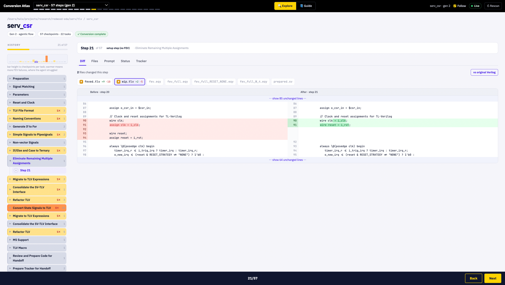

# Conversion Atlas

A web UI for exploring Verilog to TL-Verilog conversion history, built for the
[conversion-to-TLV](https://github.com/stevehoover/conversion-to-TLV) and
[LLM_TLV](https://github.com/stevehoover/LLM_TLV) flows.

Every refactoring step, its FEV result, the prompt that drove it, and the exact
code diff. Side by side. No more terminal archaeology.



## Quick start

```sh
python3 server.py <path-to-conversions> [more paths...]
# or run it with no arguments inside a conversion repo and it finds the dirs:
python3 server.py
# the guided lesson, against Steve's serv fork:
python3 server.py ~/repos/serv/tlv/serv_aligner
```

Open http://127.0.0.1:8765. That's it. No dependencies beyond Python 3.8+,
no npm, no build step, read-only against your files.

## Two views

- **Explore** (default): the working view across all scanned modules.
  Task-grouped history timeline on the left with a difficulty profile; tabs for
  side-by-side diff, files, the prompt the agent followed, status metadata,
  tracker, and agent transcripts. This is the debugging view for the team.
- **Guide**: how to use the tool and how the conversion flow works, for someone
  opening it for the first time. TL-Verilog learning material lives separately.

## What it shows

- **Module browser**: scans the given roots for conversion work dirs and lists
  every module with its current task and fev.sh status.
- **Timeline**: every checkpoint in `history/`, grouped into lanes by task,
  with per-step durations estimated from file mtimes. Arrow keys navigate. A
  difficulty bar above the timeline scales each task by its checkpoint count,
  so the tasks the agent struggled with stand out.
- **Live**: the timeline updates on its own as the agent writes new checkpoints
  (server-sent events), with a follow toggle to track the newest step and a flag
  when a task keeps running FEV without landing a checkpoint.
- **Diff**: side-by-side diff of `wip.tlv` (or any checkpointed file) between
  consecutive steps, with unchanged regions collapsed and changed words
  highlighted inline. The file list marks which files changed (M/A/D plus line
  counts) and surfaces the FEV `.eqy` when a step remaps signals. One click
  compares any step against `prepared.sv` for the cumulative change.
- **Prompt**: the task instructions the agent followed at that step, extracted
  from `conversion_tasks.md` (auto-located via the module's `scripts` symlink,
  a local LLM_TLV clone, or `--tasks-md`). Title drift between instruction
  versions is handled with fuzzy matching, disclosed in the UI.
- **Files**: view any file from any checkpoint or the working directory.
- **Agent notes**: the `status.json` metadata (`task`, `fev.sh`, `fev_cnt`,
  `llm` notes) per step.
- **Tracker**: rendered `tracker.md`.
- **Sessions**: renders the full agent conversation, including tool calls,
  from three sources, in priority order:
  1. `<module>/transcripts/*.jsonl` checked into the conversion repo itself,
     so transcripts travel with `git clone` (recommended: after a run, copy
     the session .jsonl from `~/.claude/projects/` into that folder)
  2. `~/.claude/projects/` on this machine, matched by the module's path
  3. a copied projects folder from another machine via `--claude-projects`,
     matched by module name (encoded paths differ across machines)

## Both flows supported

- **Gen 2** (`LLM_TLV/desktop_agent_verilog_conversion`): detects
  `wip.tlv` + `status.json`, reads `history/NNN/`.
- **Gen 1** (`conversion-to-TLV`): detects `history/<step>/mod_<n>/`, shows
  prompt descriptions from `prompt_id.txt`, renders the captured
  `messages.<api>.json` and `llm_response.txt` per modification, and marks
  reversion checkpoints.

## Using the frontend as an npm package

The frontend (`static/app.js`, `static/style.css`, `static/index.html`) is framework-free
and backend-agnostic. It is published as the `conversion-atlas-ui` package via git tags:

```
npm install github:vanthienha199/conversion-atlas#v1.0.0
```

Reference the files from `node_modules/conversion-atlas-ui/static/`. The API contract the
frontend expects from any backend (this Python server or a TypeScript port) is documented
in [docs/frontend-api.md](docs/frontend-api.md), which ships inside the package. To adopt
a newer UI, bump the tag and diff between tags to see what changed.

## Options

```
--port N             port (default 8765)
--host H             bind address (default 127.0.0.1)
--tasks-md PATH      explicit conversion_tasks.md for the Prompt tab
--claude-projects P  Claude Code projects dir (default ~/.claude/projects)
```

## Notes

- Durations are derived from checkpoint directory mtimes, so they are only
  meaningful on the machine where the conversion ran (a fresh git clone
  resets them).
- The Prompt tab needs `conversion_tasks.md`. The tool finds it even when a
  module's `scripts/` symlink points to an absolute path from another machine,
  by searching up for the `LLM_TLV/desktop_agent_verilog_conversion` repo. If
  it still can't find it, pass `--tasks-md PATH`.
- The server is read-only and refuses paths outside the scanned roots.

Built by Ha Le for the Redwood EDA Summer Mentorship 2026.
